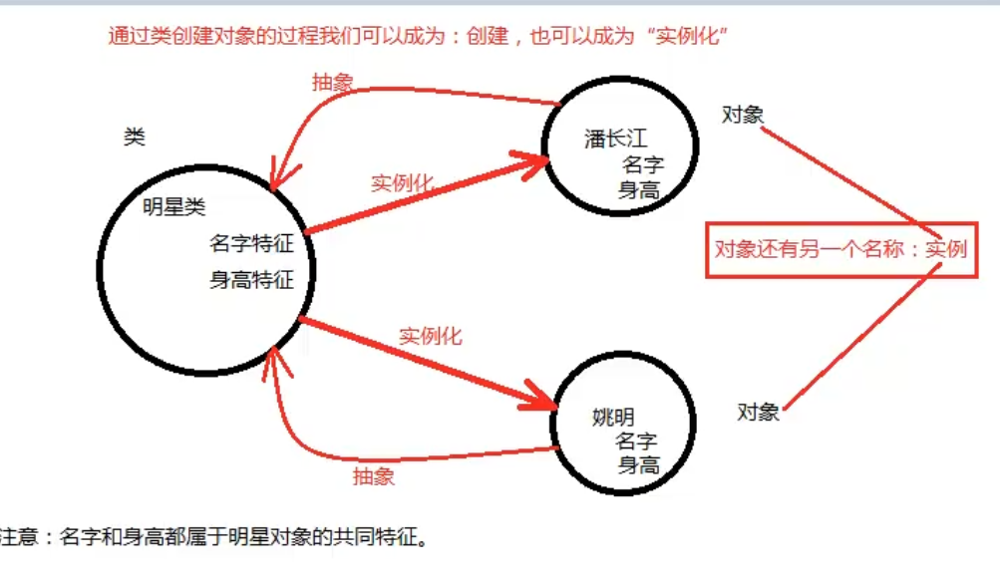
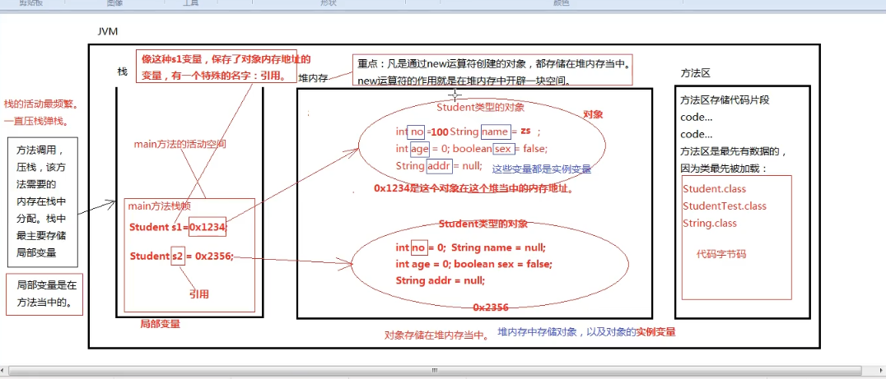
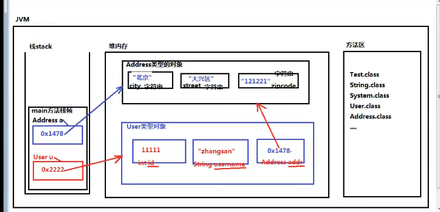

# 一、面向对象与面向过程

## 1.从语言方面出发

- C语言：完全面向过程
- C++、python：一半面向过程，一半面向对象，也称为半面向对象
- Java：完全面向对象

## 2.面向过程

**特点：**
- 注重逻辑步骤，第一步干什么，第二步干什么 ……。
- 注重功能的因果关系，因为A所以有B，因为B所以有C ……。
- 面向过程没有对象的概念，只是实现这个功能的步骤以及因果关系

**优点：**
- （快速开发） 对于小型项目（功能），采用面向过程的方式开发效率更高。
- 不需要对象的提取，模型的建立
- 采用面向过程可以直接开始写代码，编写因果关系，从而实现功能。

**缺点：**
- （耦合度高，导致扩展力差）模块间的因果关系太强，导致一个模块出问题，整个系统的运转可能都会出问题
- 面向过程开发计算机，就是一台一体机，集成到一起。面向过程开发的话，CPU是一个对象、内存是一个对象其中的一个部件坏了可以换。

## 3.面向对象
	
**特点：**
- 采用面向对象的方式进行开发，更符合人类思维方式——这也是面向对象成为主流的原因
- 人类就是以“对象”的方式去认识世界的，所以面向对象更容易让我们接受
- 以对象的方式，将现实世界分割成不同的单元，每个单元都实现成对象，共同驱动协作成一个系统
	
**优点：**
- 耦合度低，导致扩展性强

**缺点：**
- 。。。

## 4. 面向对象的三个过程
- OOA(Object-Oriented Analysis)面向对象分析
- OOD(Object-Oriented Design)面向对象设计
- OOP(Object-Oriented Programming)面向对象编程
  
- OO贯穿整个软件开发：分析(A)--> 设计(D)--> 编程(P)

## 5. 面向对象的三大特征
- 封装、继承、多态


## 二、类和对象

## 1.概念

- 类是一个抽象的概念，是人类思考、总结、抽象的一个结果
- 对象是一个实体，所以对象也叫实例。比如人是一个类，而一个活生生的人就是一个实体
- 实例化：通过类创建对象的过程叫做实例化

- 类 --> 实例化 -->对象（实例）
- 对象--> 抽象 --> 类		


## 2.类的定义与对象的创建
在编程中：类 = 属性 + 方法；属性即状态，方法即动作。

```
[修饰符列表] class 类名 {
	属性;
	属性;  // 状态，就是数据，以变量的方式存储
	……

	方法;
	方法;  // 描述动作、行为
	……  

	类名 变量名 = new 类名();  // 对象的创建
}
```

```java
public class Student {
	// 属性，在Java中以“成员变量”的方式存在
	int stu_id;
	String name;  // 这种成员变量又被称为“实例变量”
	String gender;
	String address;
}
```

```java
public class Student {
	public static void main(String[] args) {
		// Student即是类名，有时类型名，属于引用数据类型，所有的class都是如此；有点像C语言中的结构体
		Student zhangSan = new Student();  // 和 int i = 1; 一个道理；
		Student liSi = new Student();  // new Student();是一个对象
		Student wangWu = new Student();  // student类实例化了3个对象
		System.out.println(zhangSan.stu_id);  // 0
	}
}
```


# 三、对象的创建和使用

## 1.成员变量和实例变量

- 对于成员变量来说，没有手动赋值时，系统默认赋值  

|  类型   	  |   默认值  |
| ------------  | --------- |
| byte	    	|	0       |
| short	    	|   0 		|
| int 	    	|	0 		|
| long 	    	|	0L 		|
| float	    	|	0.0F 	|
| double	    |	0.0 	|
| boolean	    |	false 	|
| char	    	|	\u0000 	|
| 引用数据类型   |	null  |

- 若不通过类名来直接访问“实例变量”，必须先将类进行实例化。
- 比如：一个人有性别年龄，但人类（people class）没法说性别年龄，必须准确到人（对象）才可以


## 2.对象和引用的区别
- 对象是通过new出来的，在堆内存中存储；new 是一个运算符，专门负责对象的创建
- 引用是：变量中保存了内存地址，该地址指向堆内存当中的对象。（有点像C中的指针）

```java
public class Student {
    // 属性，在Java中以“成员变量”的方式存在
    int no;
    String name;
    int age;
    boolean sex;
    String address;
}
```

```java
public class StudentTest {
    public static void main(String[] args) {
        // 创建两个学生对象；s1,s2这局部变量叫做引用
        Student s1 = new Student();

        System.out.println(s1.no);  // 访问实例变量：引用.变量名
        System.out.println(s1.name);
        System.out.println(s1.age);
        System.out.println(s1.sex);
        System.out.println(s1.address);

        System.out.println("——————————————————————————");

        // s2也是局部变量，也叫做引用
        Student s2 = new Student();
        System.out.println(s2.no);
        System.out.println(s2.name);
        System.out.println(s2.age);
        System.out.println(s2.sex);
        System.out.println(s2.address);

        System.out.println("——————————————————————————");
        s1.no = 100;
        s1.name = "zhangSan";
        s1.age = 19;
        s1.sex = true;
        s1.address = "河南郑州";
        System.out.println(s1.no);  // 访问实例变量：引用.变量名
        System.out.println(s1.name);
        System.out.println(s1.age);
        System.out.println(s1.sex);
        System.out.println(s1.address);
    }
}
```



### 3.一个作业

```java
public class Address {
	// 一个家庭住址3个属性
	String city;
	
	String street;
	
	String zipcode;
}
```

```java
public class User {
	int id;  // 用户id
	
	String userName;
	
	Address addr;
}
```

```java
// 第一步：类加载
// 第二步：调用UserTest类的main方法（方法调用要压栈）
public class Test {
    public static void main(String[] args) {

        User Jack = new User();
        Address a = new Address();

        a.city = "河南郑州";
        a.street = "博学路街道";
        a.zipcode = "450000";

        Jack.id = 112;
        Jack.userName = "Jack";
        Jack.addr = a;  // 引用不一定是局部变量，Jack.addr在堆中存储，它是成员变量，也是实例变量

        System.out.println("Jack`s id :" + Jack.id);
        System.out.println("Jack`s userName :" + Jack.userName);

        // addr是一个对象，所以会打印addr在堆内存的地址
        System.out.println("Jack`s addr :" + Jack.addr);  // Address@6d03e736

        System.out.println("Jack`s addr`s city :" + Jack.addr.city);
        System.out.println("Jack`s addr`s street :" + Jack.addr.street);
        System.out.println("Jack`s addr`s .zipcode :" + Jack.addr.zipcode);

        Jack.addr.city = "杭州";
        System.out.println("Jack`s addr`s city :" + Jack.addr.city);

        User Rose = new User();
        System.out.println("Rose's useName : " + Rose.userName);
        
        /*
        Error: Cannot assign field "city" because "Rose.addr" is null
        
        Rose.addr.city = "Beijing";
        System.out.println("Rose`s hometown is " + Rose.addr.city);
         */
    }
}
```


# 四、引用数据类型

## 1.属性是引用数据类型怎么访问

```java

public class ReferenceDataType {
    A a;  // 成员变量中的实例变量，必须先创建对象，然后通过引用来访问

    public static void main(String[] args) {
        ReferenceDataType t = new ReferenceDataType();
        A a = new A();
        B b = new B();
        C c = new C();
        D d = new D();
        
        t.a = a;
        a.b = b;
        b.c = c;
        c.d = d;

        System.out.println(t.a.b.c.d.i);  // 0
    }

}

class A{
    B b;

}

class B{
    C c;
}

class C{
    D d;
}

class D{
    int i;
}
```

## 2.空指针异常
